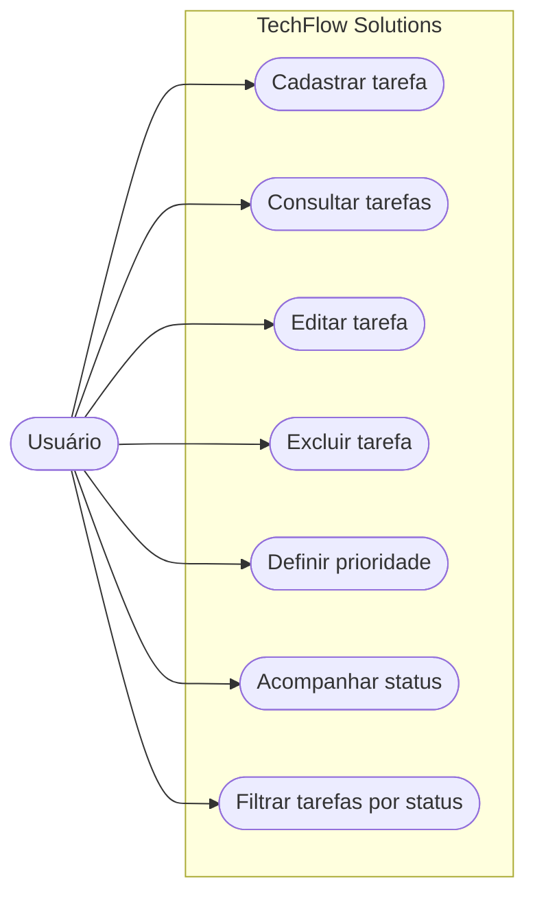

```mermaid
flowchart LR
    Usuario([Usuário])

    subgraph Sistema["TechFlow Solutions"]
        A([Cadastrar tarefa])
        B([Consultar tarefas])
        C([Editar tarefa])
        D([Excluir tarefa])
        E([Definir prioridade])
        F([Acompanhar status])
        G([Filtrar tarefas por status])
    end

    Usuario --> A
    Usuario --> B
    Usuario --> C
    Usuario --> D
    Usuario --> E
    Usuario --> F
    Usuario --> G
```
