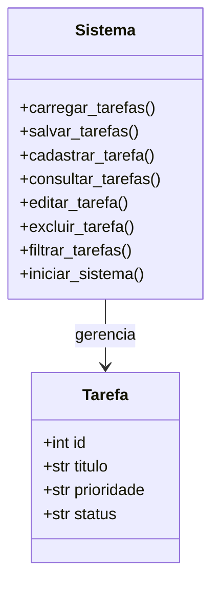

```mermaid
classDiagram
    class Tarefa {
        +int id
        +str titulo
        +str prioridade
        +str status
    }

    class Sistema {
        +carregar_tarefas()
        +salvar_tarefas()
        +cadastrar_tarefa()
        +consultar_tarefas()
        +editar_tarefa()
        +excluir_tarefa()
        +filtrar_tarefas()
        +iniciar_sistema()
    }

    Sistema --> Tarefa : gerencia
```
