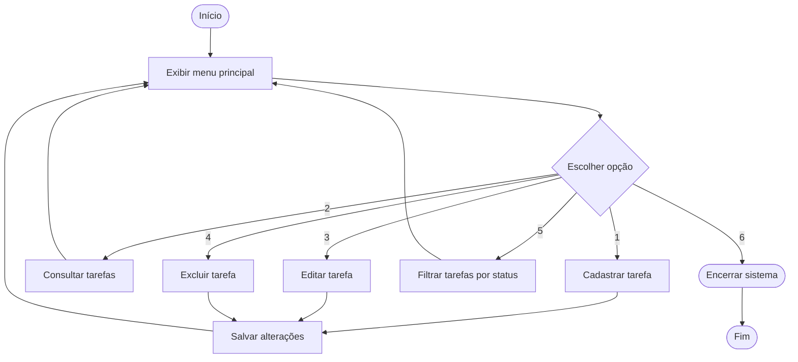

```mermaid
flowchart TD
    A([Início]) --> B[Exibir menu principal]
    B --> C{Escolher opção}

    C -->|1| D[Cadastrar tarefa]
    C -->|2| E[Consultar tarefas]
    C -->|3| F[Editar tarefa]
    C -->|4| G[Excluir tarefa]
    C -->|5| H[Filtrar tarefas por status]
    C -->|6| I([Encerrar sistema])

    D --> J[Salvar alterações]
    E --> B
    F --> J
    G --> J
    H --> B
    J --> B

    I --> K([Fim])
```
